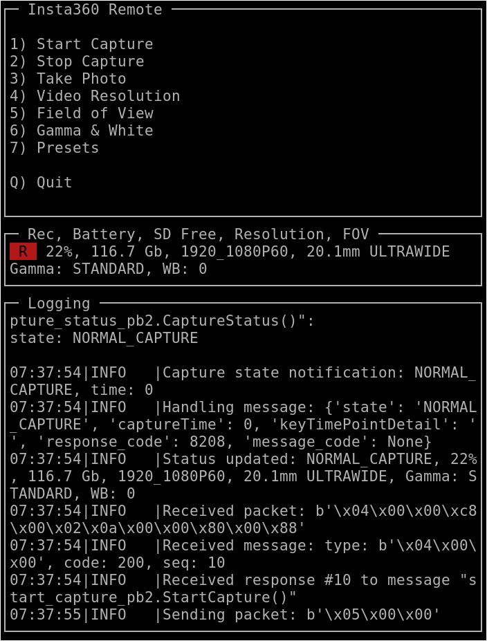

# insta360-wifi-api

**Python scripts to talk to Insta360 action cameras using the WiFi API**

The insta360.py is a Python class which partially implements the 
WiFi API interface (TCP socket on port 6666) to communicate and 
control an Insta360 camera. It was developed by reverse 
engineering the communication between an **Insta360 ONE RS** 
camera and the Android app.

## Connecting to the WiFi

Fortunately enough it is possibile to connect a GNU/Linux PC to 
the Insta360 through the WiFi, the default passowrd of the 
camera internal access point is **88888888**.

Said incidentally, this is an **huge security hole** of the 
camera: as far I know it is not possibile to disable the WiFi 
interface or change the password (at least from the camera touch 
screen interface), so any host in the nearby can connect to your 
camera as soon it is turned on; once estabilished the connection 
you can also do a **telnet** into the Insta360's GNU/Linux 
operating system as **root** (the IP address of the camera is 
**192.168.42.1**) and do whaterver you want, even to damage 
permanently (brick) the camera.

## What is working

Only some of the messages are implemented into the Python
class, and they do not support many arguments, but you can
read the code and inspect the protobuf definition to know
what parameters are accepted.

**Implemented methods:**

* SyncLocalTimeToCamera()
* GetCameraInfo()
* GetNormalVideoOptions()
* SetNormalVideoOptions()
* StartCapture()
* StopCapture()
* TakePicture()
* GetCameraFilesList()

**Usage example:**

```python
#!/usr/bin/env python3

import logging
import insta360

logging.basicConfig(format='%(asctime)s %(levelname)-8s %(message)s')
logging.getLogger().setLevel(logging.DEBUG)

cam = insta360.camera(host='192.168.42.1', port=6666)
cam.Open()

seq = cam.StartCapture()
print('Sent packet StartCapture(): seq: %d' % (seq,))
time.sleep(20)
seq = cam.StopCapture()
print('Sent packet StopCapture(): seq: %d' % (seq,))

# Wait messages eventually in the queue.
time.sleep(5)
cam.Close()
```

## The Protobuf problem

The messages exchanged from the Android app and the camera
use the **Protocol Buffers**, which is an open standard by Google.

Unfortunately the protobuf messages are not self-describing; 
that is, there is no way to tell the names, meaning, or full 
datatypes of exchanged messages without an external 
specification. To write an understandable source code you need 
to extract the specific language description files from a 
compiled binary file, e.g. a library from the Android app. To 
run the insta360.py module you need such files compiled for 
Python. Follow the link at the bottom of this page to get more 
instructions.

## The insta360-remote program

The **insta360-remote** is a somewhat working example using the 
insta360.py module. It is a Python program using the curses 
library, so it can be run into a text terminal. It has the basic 
functionality required for a remote control: start and stop 
recording, take picture, set the video resolution and zoom. You 
can run it from an Android smartphone if you install the 
[Termux](https://termux.dev/en/) app and the required Python 
libraries.




More info here: [Insta360: WiFi protocol reverse engineering](https://www.rigacci.org/wiki/doku.php/doc/appunti/hardware/insta360_one_rs_wifi_reverse_engineering).
